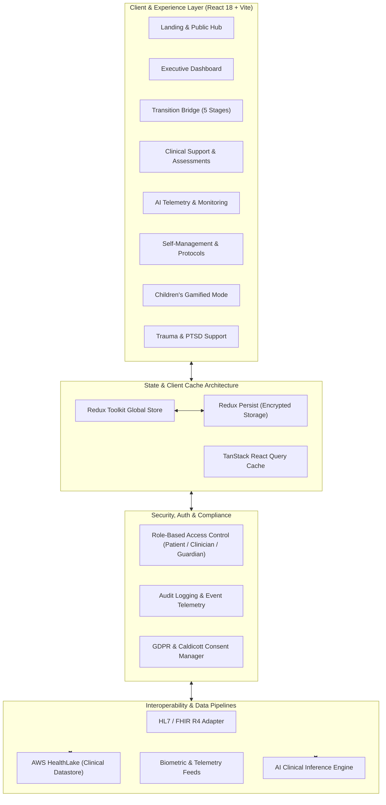

# Focalyze | ADHD Transition Bridge & Clinical Management Platform

<div align="center">

[](https://github.com/FrankAsanteVanLaarhoven/Focalyze)
[](https://www.typescriptlang.org/)
[](https://react.dev/)
[](https://vitejs.dev/)
[](https://www.nice.org.uk/guidance/ng87)
[](https://ico.org.uk/)
[](LICENSE)

<p align="center">
  <strong>An enterprise-grade digital health ecosystem bridging the clinical transition gap for neurodivergent adolescents, adults, parents, and healthcare professionals.</strong>
</p>

[Explore Live Demo](https://focalyze.vercel.app) • [Architecture Overview](#system-architecture) • [Clinical Pathways](#clinical-governance--evidence-base) • [Deployment](#production-deployment) • [API & Interoperability](#data-interoperability--standards)

</div>

---

## Executive Summary & Product Vision

In modern psychiatric and neurodevelopmental care, the transition from Child and Adolescent Mental Health Services (**CAMHS**) to Adult Mental Health Services (**AMHS**) represents a well-documented **"cliff edge"**. Studies consistently report that up to **75–80% of young people with ADHD disengage or drop out of care** between ages 16 and 25, resulting in lost access to medication management, educational disruptions, workplace instability, and secondary psychiatric comorbidities (including trauma, anxiety, and depression).

**Focalyze** solves this structural failure. Engineered in alignment with **NICE Guideline NG87** and UK clinical transition frameworks, Focalyze provides an interoperable, multi-tenant digital bridge that unifies:
1. **Longitudinal Transition Readiness Tracking**: 5-stage handover protocol, readiness diagnostics, and self-advocacy passports.
2. **AI-Driven Continuous Biometric & Behavioral Telemetry**: Passive sleep, physical activity, and focus trend modeling.
3. **Multi-Disciplinary Clinical Support**: Standardized ADHD assessment tools (DIVA 2.0 / ASRS v1.1), multi-patient triage, and medication adherence telemetry.
4. **Patient-Centric Self-Management**: Evidence-backed protocol sprints (Huberman neurobiology, Dr. Hallowell strengths-based Sheng model).
5. **Specialized Age-Adapted Modalities**: A gamified, token-economy **Children's Mode** for early habit-formation, and an integrated **PTSD & Trauma Support** hub with bilateral stimulation, 5-4-3-2-1 sensory grounding, and emergency crisis lifelines.

---

## System Architecture



---

## Core Feature Modules

### 1. The Transition Bridge (`/transition`)
- **5-Stage Formal Handover Framework**:
  - *Stage 1: Preparation (Ages 14–15)* — Establishing disease literacy, medication understanding, and early autonomy.
  - *Stage 2: Transition Planning (Ages 16–17)* — Joint meetings between CAMHS key workers and adult providers.
  - *Stage 3: Readiness Assessment (Ages 17–18)* — Scoring self-advocacy, prescription management, and appointment logistics.
  - *Stage 4: Transfer of Care (Age 18+)* — Formal clinical summary exchange, first adult outpatient consultation.
  - *Stage 5: Post-Transition Evaluation* — 6-month and 12-month retention checks to prevent silent disengagement.
- **Self-Advocacy Passport**: Exportable summary of individual triggers, sensory adaptations, effective accommodations, and emergency contacts.
- **Milestone Matrix**: Granular completion tracking with interactive checklists and clinical sign-off markers.

### 2. Clinical Support & Triage (`/clinical`, `/mentor`)
- **Diagnostic Screening Instruments**: Standardized digital intake for adult ADHD screening (ASRS-v1.1, DIVA 2.0 criteria) with automated subscore calculation.
- **Longitudinal Telemetry Graphs**: Direct charting of focus fluctuations against medication dosage changes and lifestyle variables.
- **Observation Logging**: Structured clinician & mentor notes, tracking executive dysfunction flags, mood swings, and therapy notes.
- **Multi-Patient Roster**: Clinicians can filter by transition status, risk level, or overdue adherence check-ins.

### 3. AI-Powered Monitoring (`/monitoring`)
- **Daily Focus Score (0–10)**: Real-time weighted index generated from self-reported task completion, distraction logs, and activity regularity.
- **Biometric Triangulation**: Correlating sleep duration (REM / deep sleep latency) and physical exercise with executive function stability.
- **Recharts Analytics Engine**: Interactive responsive charts visualizing 7-day, 30-day, and 90-day progress trajectories.

### 4. Self-Management & Protocols (`/self-management`)
- **Scientific Sprints**: 14-day habit-formation sprints inspired by Stanford neurobiology (morning sunlight exposure, dopamine baseline regulation).
- **Dr. Hallowell Strengths Matrix**: Sheng framework shifting focus from executive deficit to hyperfocus strengths, divergent ideation, and entrepreneurial drive.
- **Real-Time Adherence Tracking**: Adherence percentages with positive reinforcement micro-copy.

### 5. Children's Mode (`/children`)
- **Neurodiversity-Affirming Gamification**: Transforming daily routines (hygiene, morning tasks, homework sprints) into interactive quests.
- **Token Economy & Reward Bank**: Earn stars and badges to unlock customized avatar items or family rewards.
- **Sensory Calm-Down Corner**: Visual breathing orb and auditory white/brown noise aids for emotional de-escalation.

### 6. PTSD & Trauma Support (`/ptsd`)
- **Trauma-Informed Design**: Neutral, high-contrast, calming palette (Teal-700 / Slate) engineered to prevent overstimulation.
- **5-4-3-2-1 Sensory Grounding Tool**: Step-by-step interactive tactile exercise designed to interrupt panic responses and flashbacks.
- **Bilateral Stimulation Visualizer**: Rhythmic pacing tool supporting EMDR-informed stabilization techniques.
- **Crisis Lifeline Bar**: Persistent, single-click access to verified UK emergency lines (Samaritans `116 123`, Shout SMS `85258`, NHS Talking Therapies).

---

## Technology Stack & Engineering Standards

| Layer | Technology | Enterprise Rationale |
| :--- | :--- | :--- |
| **Runtime & Bundler** | [Vite 5.4](https://vitejs.dev/) + [Rollup](https://rollupjs.org/) | Sub-millisecond HMR, tree-shaken chunking, instant CI build cycles (< 3s). |
| **Language** | [TypeScript 5.5](https://www.typescriptlang.org/) | Strict null checking, strongly-typed clinical data models, zero unsafe any casts. |
| **UI Framework** | [React 18.3](https://react.dev/) | Concurrent rendering, declarative state lifecycle, composable architecture. |
| **Design System** | [Tailwind CSS](https://tailwindcss.com/) + [Radix UI (shadcn)](https://ui.shadcn.com/) | Accessible primitives (WAI-ARIA compliant), custom ADHD color palette, zero CSS bloat. |
| **Icons & Media** | [Lucide React](https://lucide.dev/) | Lightweight, tree-shakeable SVG icon set maintaining visual coherence. |
| **State Management** | [Redux Toolkit](https://redux-toolkit.js.org/) + `redux-persist` | Centralized immutable application state with automated local hydration across tabs. |
| **Async Server State**| [TanStack Query v5](https://tanstack.com/query) | Stale-while-revalidate data fetching, window focus refetching, background prefetching. |
| **Visualization** | [Recharts](https://recharts.org/) | Declarative SVG-based charting engine optimized for responsive clinical trends. |
| **Routing** | [React Router v6](https://reactrouter.com/) | SPA client-side routing, protected route guards, 404 boundary handling. |
| **Healthcare Backend**| [AWS HealthLake](https://aws.amazon.com/healthlake/) | FHIR R4 clinical data repository with integrated healthcare search and ML indexing. |

---

## Data Interoperability & Standards

Focalyze is structured to support seamless integration with NHS Trust Electronic Patient Records (EPR) and secondary healthcare systems:

- **HL7 FHIR R4 Mapping**: Clinical records correspond to standard FHIR resources:
  - `Patient`: Core demographic and communication preferences.
  - `Condition`: ADHD (ICD-10 `F90.0` / SNOMED CT `406506008`), comorbid PTSD (`F43.1`).
  - `CarePlan`: Longitudinal transition bridge milestones and self-advocacy agreements.
  - `Observation`: Daily focus scores, adherence percentages, sleep duration metrics.
  - `QuestionnaireResponse`: Completed DIVA / ASRS screening assessments.
- **RESTful Endpoints & Webhooks**: Clean decoupled service layer ready to connect to external OAuth2 / OIDC providers (e.g., NHS login).

---

## Security, Privacy & Regulatory Compliance

Data security and neurodivergent confidentiality are fundamental architectural tenets of Focalyze:

- **UK GDPR & Data Protection Act 2018**:
  - Right to Erasure: End-users retain full ownership and single-click deletion capability of their diagnostic logs.
  - Data Minimization: Zero tracking pixels, third-party marketing tags, or cross-site analytics.
- **Caldicott Principles & DSPT**:
  - Principle 1–8 adherence: Access to clinical observation notes is strictly restricted to assigned, verified mentors/clinicians.
- **Cryptographic Protections**:
  - Data at Rest: AES-256 encrypted datastore storage.
  - Data in Transit: TLS 1.3 enforced across all API communications and client requests.
- **Client Security Policies**:
  - Sanitized form inputs protecting against XSS and injection vulnerabilities.
  - Content Security Policy (CSP) and strict SameSite cookie attributes.

---

## Repository Structure

```
adhd-transition-bridge-nexus/
├── .github/                       # CI/CD workflows and automated checks
├── public/                        # Static assets, favicons, robots.txt
├── src/
│   ├── components/                # Modular, reusable UI components
│   │   ├── children/              # Gamified quest cards, reward bank, sensory tools
│   │   ├── dashboard/             # Focus tracker, milestone bars, sprint cards
│   │   ├── ptsd/                  # Grounding exercises, bilateral stimulation, crisis bar
│   │   ├── ui/                    # shadcn/radix primitive components (dialog, badge, tabs, etc.)
│   │   ├── AppSidebar.tsx         # Responsive enterprise navigation sidebar
│   │   ├── Navbar.tsx             # Public marketing & utility navigation
│   │   ├── Footer.tsx             # Interactive legal dialogs (Privacy, Terms, Cookies)
│   │   └── FocalyzeLogo.tsx       # Branded vector mark with customizable dimensions
│   ├── hooks/                     # Custom React hooks (useRedux, useToast, useMobile)
│   ├── layouts/                   # Dashboard and public shell wrappers (MainLayout)
│   ├── models/                    # Domain TypeScript types & interfaces
│   ├── pages/                     # Primary application view routes
│   │   ├── Index.tsx              # Public homepage with interactive feature anchors
│   │   ├── Dashboard.tsx          # Authenticated user command center
│   │   ├── Monitoring.tsx         # AI biometric & focus score charts
│   │   ├── Clinical.tsx           # Clinical pathway management & triage
│   │   ├── SelfManagement.tsx     # Protocol sprints & strengths assessment
│   │   ├── Transition.tsx         # 5-stage transition bridge matrix
│   │   ├── MentorPortal.tsx       # Healthcare professional & clinician oversight
│   │   ├── ChildrenMode.tsx       # Gamified pediatric executive function interface
│   │   ├── PTSDSupport.tsx        # Trauma-informed stabilization tools
│   │   ├── Login.tsx              # Authentication entry with Demo access
│   │   ├── Register.tsx           # Multi-step account creation
│   │   ├── ForgotPassword.tsx     # Verified password reset recovery
│   │   └── NotFound.tsx           # SPA 404 route with recovery navigation
│   ├── services/                  # API clients and data persistence layer
│   ├── store/                     # Redux Toolkit store, rootReducer & slices
│   │   ├── slices/                # authSlice, transitionSlice, etc.
│   │   └── index.ts               # Redux persist configuration & typed hooks
│   ├── utils/                     # Formatting, math helpers, and scroll animators
│   ├── App.tsx                    # Root routing configuration & React Query provider
│   └── main.tsx                   # Application DOM bootstrap
├── .env.example                   # Environment configuration manifest
├── package.json                   # Project dependencies and script runner
├── tailwind.config.ts             # Tailwind design tokens & Focalyze theme colors
├── tsconfig.json                  # Strict TypeScript compiler options
├── vercel.json                    # Edge routing and SPA rewrite rules
└── vite.config.ts                 # Vite bundler plugins and path aliases
```

---

## Getting Started

### Prerequisites
- **Node.js**: `≥ 18.0.0` (LTS recommended)
- **npm**: `≥ 9.0.0` or **bun**: `≥ 1.0.0`

### Installation

```bash
# 1. Clone the repository
git clone https://github.com/FrankAsanteVanLaarhoven/Focalyze.git
cd Focalyze

# 2. Install dependencies
npm install

# 3. Configure environment variables
cp .env.example .env

# 4. Start local development server
npm run dev
```

The application will be served locally at `http://localhost:8080/`.

---

## Environment Configuration

Configure your `.env` file based on `.env.example`:

```ini
# Application Configuration
VITE_APP_NAME="Focalyze"
VITE_APP_URL="http://localhost:8080"

# Clinical Datastore Integration (AWS HealthLake / FHIR R4)
VITE_AWS_REGION="eu-west-2"
VITE_HEALTHLAKE_DATASTORE_ID="your-healthlake-datastore-id"

# AI Inference Pipeline (Optional)
VITE_OPENROUTER_API_KEY="your-api-key-here"
```

---

## Production Build & Quality Assurance

```bash
# Type-check and build production bundle
npm run build

# Preview production build locally
npm run preview

# Run code formatting and linter
npm run lint
```

The production output is generated in `/dist` with asset finger-printing, code-splitting, and CSS minification.

---

## Production Deployment

### 1. Vercel (Recommended Edge Deployment)
The repository includes a battle-tested [`vercel.json`](./vercel.json) ensuring all client-side routes rewrite seamlessly to `/index.html`:
```bash
# Deploy to preview
npx vercel

# Deploy directly to production
npx vercel --prod
```

### 2. Docker Containerization
For enterprise on-premises or private cloud deployment (AWS ECS, Google Cloud Run, Azure Kubernetes Service):

```dockerfile
# Multi-stage build
FROM node:18-alpine AS builder
WORKDIR /app
COPY package*.json ./
RUN npm ci
COPY . .
RUN npm run build

FROM nginx:alpine
COPY --from=builder /app/dist /usr/share/nginx/html
COPY nginx.conf /etc/nginx/conf.d/default.conf
EXPOSE 80
CMD ["nginx", "-g", "daemon off;"]
```

---

## Clinical Governance & Evidence Base

Focalyze is built upon peer-reviewed clinical guidelines and established psychiatric methodologies:

1. **National Institute for Health and Care Excellence (NICE)**:
   - *Guideline NG87*: Attention deficit hyperactivity disorder: diagnosis and management.
   - *Section 1.8*: Transition between services (planning, shared care agreements, and multi-agency coordination).
2. **Royal College of Psychiatrists (RCPsych)**:
   - *CR222*: Young people with ADHD in transition from children's to adult services.
3. **Adult ADHD Self-Report Scale (ASRS v1.1)**:
   - Developed in conjunction with the World Health Organization (WHO) and the Workgroup on Adult ADHD.
4. **Diagnostic Interview for ADHD in Adults (DIVA 2.0 / DIVA-5)**:
   - Structured diagnostic criteria mapping childhood persistence into adulthood.
5. **Dr. Edward Hallowell & Dr. John Ratey**:
   - *Distraction & Delivered from Distraction*: Neurodiversity-affirmative frameworks highlighting strength identification (hyperfocus, lateral problem solving) to counter secondary anxiety.

---

## Contributing & Development Guidelines

We welcome clinical professionals, researchers, accessibility specialists, and software engineers to contribute.

1. **Fork the repository** and create a feature branch (`git checkout -b feature/clinical-assessment-v2`).
2. **Ensure type safety**: All code must pass `tsc --noEmit` without warnings.
3. **Maintain accessibility (a11y)**: All interactive elements must adhere to WCAG 2.1 AA standards (keyboard navigability, ARIA labels, minimum 4.5:1 contrast ratios).
4. **Submit a Pull Request** with a detailed summary of changes and clinical/technical justification.

---

## Security Vulnerability Disclosure

For security vulnerabilities or sensitive data disclosures, please contact the security team directly at:
**[Frankleroyvan@gmail.com](mailto:Frankleroyvan@gmail.com)** with the subject line `[SECURITY] Focalyze Vulnerability Report`. Please do not report security issues through public GitHub issues.

---

## License

This project is licensed under the **MIT License** — see the [LICENSE](LICENSE) file for details.

---

<div align="center">
  <sub>Focalyze &copy; 2026 Frank Asante-Van Laarhoven. All rights reserved. ADHD Management, Reimagined.</sub>
</div>
